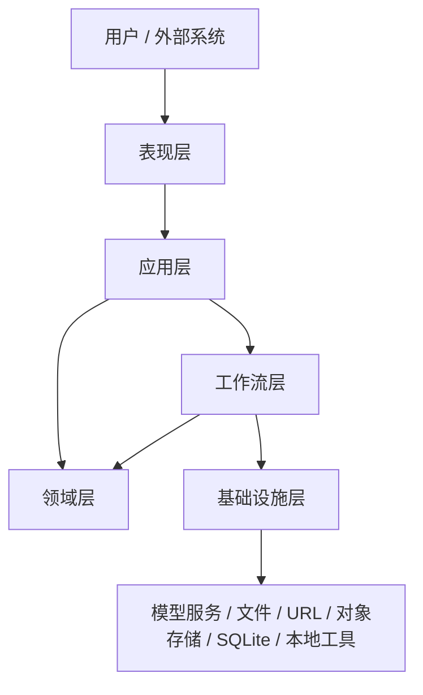

# 总体设计

## 1. 文档目的

说明 `simple-ai-agent` 项目的总体目标、架构边界、分层设计和核心运行机制。

## 2. 项目目标

本项目定位为一个分析型 Agent 底座，阶段 1 目标是形成最小企业级闭环：
- 支持 CLI 和 HTTP API
- 支持多模型接入
- 支持图片、音频、视频、文件的真实输入
- 支持本地工具网关
- 支持任务、资产、工具结果落库与查询
- 支持结构化排障

## 3. 总体架构

### 分层结构

- `presentation`
- `application`
- `domain`
- `workflow`
- `infrastructure`

### 总体架构图

## 4. 核心运行流程

## 5. 核心能力

- 多模型接入
- 多模态输入
- 上传文件标准化
- 工具自动路由
- PDF 解析
- 视频抽帧、抽音轨、关键帧 OCR、音轨 ASR
- 任务追踪
- 资产查询
- 结构化错误响应

## 6. 总体设计原则

- 职责分层清晰
- 输入统一标准化
- 工具调用可追踪
- 失败也必须可查询
- 文档与代码同步维护
- 配置与能力可治理
- 安全边界前置设计
- 成本、性能与稳定性同时约束
- 对外协议版本化

## 7. 企业级底座还必须补齐的治理能力

作为长期演进的 Agent 底座，除功能链路外，还必须规划以下治理能力：

### 7.1 统一鉴权与权限治理

- API Key / Bearer Token
- 用户、租户、角色、权限模型
- 入口鉴权、中间件鉴权、资源级鉴权

### 7.2 失败重试与恢复策略

- 模型调用重试
- 工具调用重试
- 超时、退避、熔断、降级
- 幂等控制与重复提交保护

### 7.3 Trace 与可观测性

- trace service
- trace dashboard
- 指标监控与告警
- 任务、工具、模型三类链路统一关联

### 7.4 安全与策略控制

- Prompt 安全边界
- 工具调用白名单
- 上传文件类型与大小限制
- 敏感信息脱敏与审计

### 7.5 配置与版本治理

- 环境配置分层
- Provider 配置管理
- Prompt 版本管理
- API 版本管理

### 7.6 成本与资源治理

- 模型成本统计
- 工具调用资源配额
- 并发上限
- 队列与长任务资源控制

## 8. 当前边界

当前不包含：
- 权限系统
- 分布式任务调度
- 多 Agent 编排
- 生产级监控平台

这些内容属于阶段 2 及以后。
