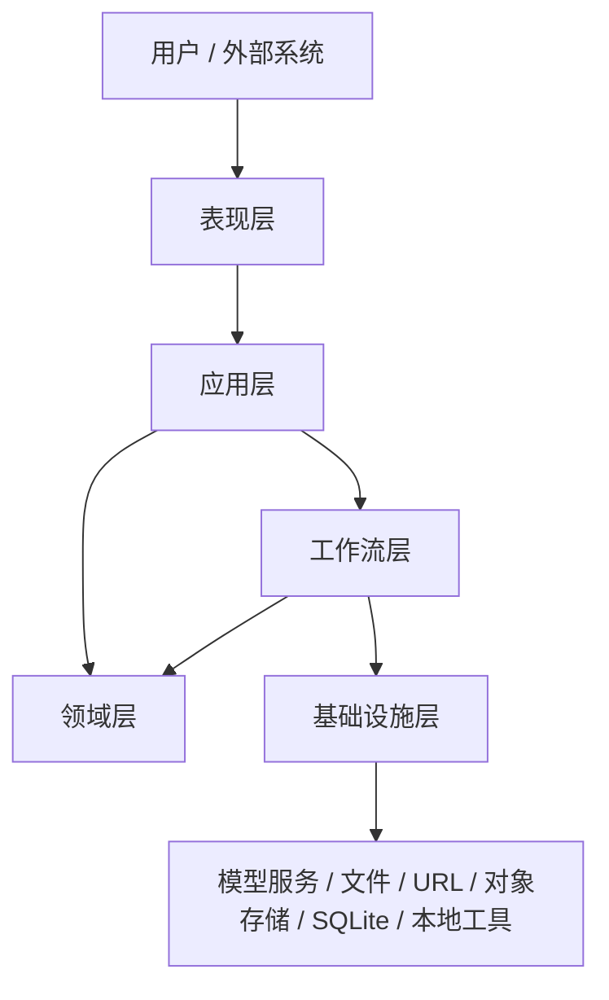

# 总体设计

## 1. 文档目的

说明 `simple-ai-agent` 项目的总体目标、架构边界、分层设计和核心运行机制。

## 2. 项目目标

本项目定位为一个分析型 Agent 底座，阶段 1 目标是形成最小企业级闭环：
- 支持 CLI 和 HTTP API
- 支持多模型接入
- 支持图片、音频、视频、文件的真实输入
- 支持本地工具网关
- 支持任务、资产、工具结果落库与查询
- 支持结构化排障

## 3. 总体架构

### 分层结构

- `presentation`
- `application`
- `domain`
- `workflow`
- `infrastructure`

### 总体架构图

## 4. 核心运行流程

## 5. 核心能力

- 多模型接入
- 多模态输入
- 上传文件标准化
- 工具自动路由
- PDF 解析
- 视频抽帧、抽音轨、关键帧 OCR、音轨 ASR
- 任务追踪
- 资产查询
- 结构化错误响应

## 6. 面向多工具与多 Agent 场景的演进设计

在保留当前主流程简洁性的前提下，项目已将后续能力演进收敛为以下四个方向：

### 6.1 请求路由中台

目标：
- 在入口层与工作流层之间增加统一请求路由能力
- 按输入类型、任务类型、调用来源、模型策略、工具能力和后续权限策略完成分发

当前状态：
- 仅支持基于输入资产类型的最小工具路由
- 尚未形成独立的请求路由中台

演进原则：
- 路由决策与具体工作流执行解耦
- 路由结果必须可追踪、可落库、可复盘

### 6.2 异步任务体系

目标：
- 将长耗时任务从同步请求中解耦
- 支持排队、执行、重试、取消、回查和状态通知

当前状态：
- 已具备 `task_id`、`trace_id`、任务落库与任务查询基础
- 尚未实现队列、Worker、调度器和异步状态机

演进原则：
- 同步链路与异步链路共用统一任务模型
- 长任务必须支持失败重试与结果回查

### 6.3 权限控制

目标：
- 建立入口鉴权、资源鉴权、工具级授权与审计能力

当前状态：
- 当前版本未实现统一鉴权和权限控制

演进原则：
- 鉴权前置
- 权限决策与业务编排解耦
- 所有敏感工具调用必须具备审计记录

### 6.4 多 Agent 编排

目标：
- 由单 Agent 执行链演进为可协同的多 Agent 编排底座
- 支持角色拆分、任务接力、上下文传递和结果汇聚

当前状态：
- 当前仅支持单 Agent 线性执行流程
- 尚未实现 Agent Router、Agent Handoff 和协同状态管理

演进原则：
- 保持主流程最小可解释
- 新增编排能力时优先复用现有状态模型、任务模型和追踪模型

## 7. 总体设计原则

- 职责分层清晰
- 输入统一标准化
- 工具调用可追踪
- 失败也必须可查询
- 文档与代码同步维护
- 配置与能力可治理
- 安全边界前置设计
- 成本、性能与稳定性同时约束
- 对外协议版本化

## 8. 企业级底座还必须补齐的治理能力

作为长期演进的 Agent 底座，除功能链路外，还必须规划以下治理能力：

### 8.1 统一鉴权与权限治理

- API Key / Bearer Token
- 用户、租户、角色、权限模型
- 入口鉴权、中间件鉴权、资源级鉴权

### 8.2 失败重试与恢复策略

- 模型调用重试
- 工具调用重试
- 超时、退避、熔断、降级
- 幂等控制与重复提交保护

### 8.3 Trace 与可观测性

- trace service
- trace dashboard
- 指标监控与告警
- 任务、工具、模型三类链路统一关联

### 8.4 安全与策略控制

- Prompt 安全边界
- 工具调用白名单
- 上传文件类型与大小限制
- 敏感信息脱敏与审计

### 8.5 配置与版本治理

- 环境配置分层
- Provider 配置管理
- Prompt 版本管理
- API 版本管理

### 8.6 成本与资源治理

- 模型成本统计
- 工具调用资源配额
- 并发上限
- 队列与长任务资源控制

## 9. 当前边界

当前不包含：
- 权限系统
- 请求路由中台
- 分布式任务调度
- 异步任务执行体系
- 多 Agent 编排
- 生产级监控平台

这些内容属于阶段 2 及以后。
