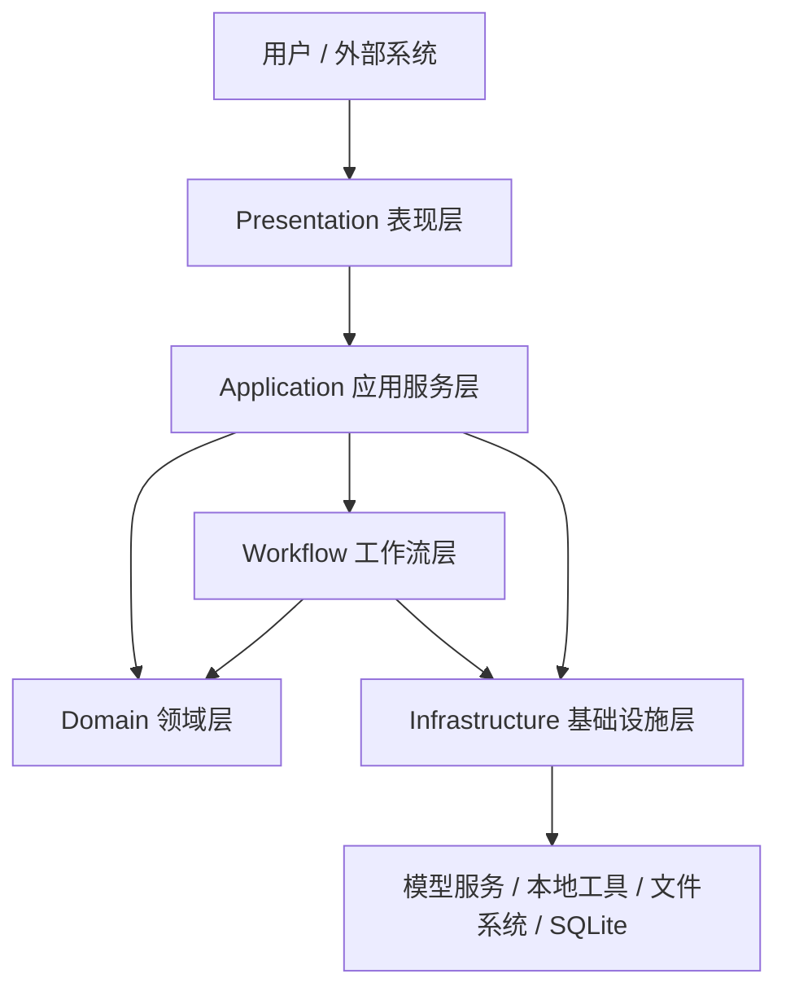
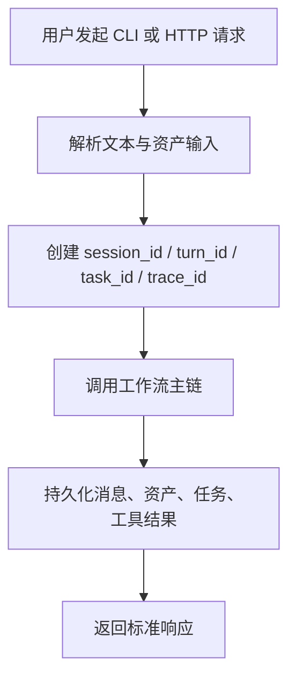
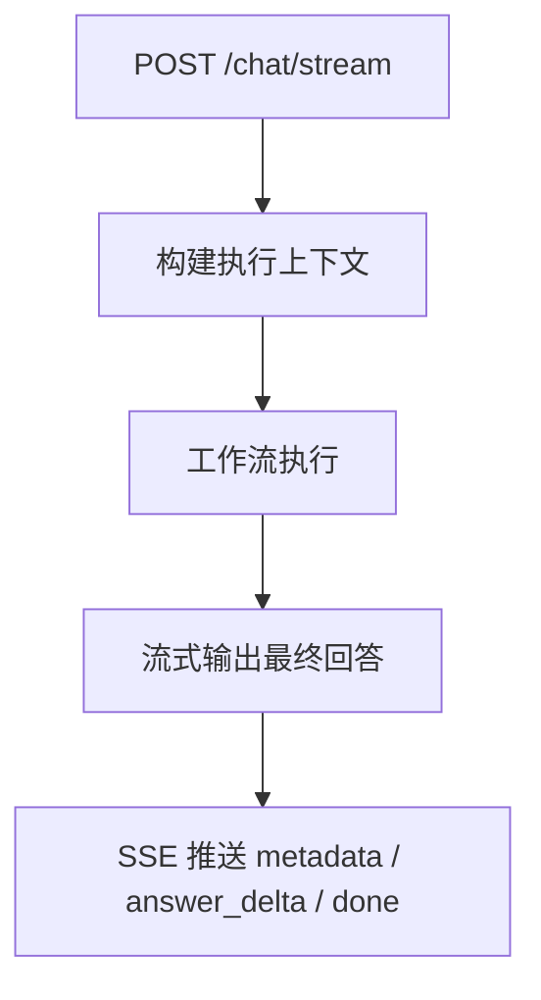
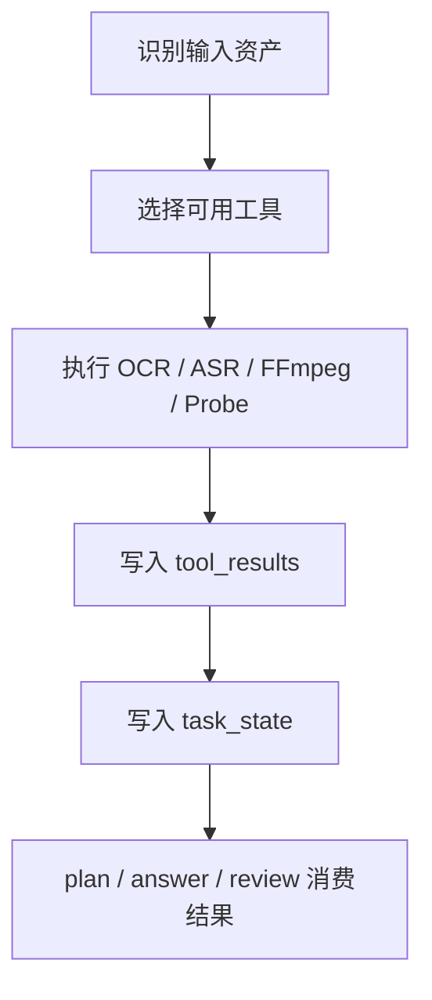
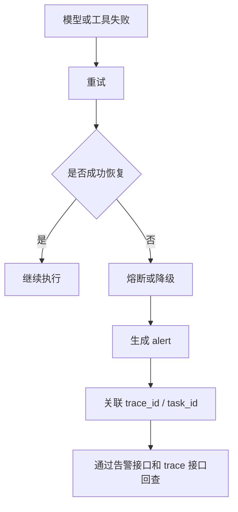
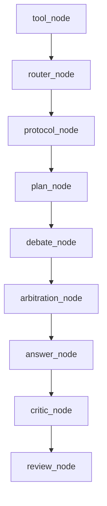

# 总体设计

## 1. 文档目的

本文档用于说明 AgentOps 项目的总体目标、总体架构、核心能力边界、阶段建设路线和关键设计原则。

本文档回答以下问题：
- 这个项目是什么
- 这个项目当前做到什么程度
- 系统整体如何分层
- 核心运行链路是什么
- 当前阶段与后续阶段如何衔接

## 2. 项目定位

AgentOps 是一个基于 Python、LangGraph 和 OpenAI 兼容协议的 Agent 底座项目。

项目目标不是做一个单点聊天应用，而是逐步建设一个具备以下能力的后端 Agent 平台底座：
- 可对话
- 可调用工具
- 可处理多模态输入
- 可追踪
- 可治理
- 可恢复
- 可配置
- 可逐步扩展为多 Agent 编排平台

当前项目状态如下：
- 阶段 1 已完成
- 阶段 2 正在开发
- 当前阶段 2 进度约为 `75% - 80%`

## 3. 总体建设目标

### 3.1 阶段 1 目标

阶段 1 目标是形成最小企业级闭环，覆盖：
- CLI 与 HTTP API
- 持续对话
- 多模型兼容接入
- 图片、音频、视频、文件输入
- 上传与资产标准化
- 工具注册与自动调用
- 会话、任务、资产、工具结果落库
- 统一错误结构
- 基础日志与追踪

### 3.2 阶段 2 目标

阶段 2 目标是从“能跑通”升级到“能治理、能编排、能恢复”，覆盖：
- 统一鉴权
- 最小 RBAC 授权
- 限流与幂等
- trace service
- 恢复告警与恢复策略
- 配置中心
- 角色注册中心
- 最小多 Agent 编排
- 正式角色协议
- 可切换执行协议
- 流式输出

### 3.3 阶段 3 目标

阶段 3 目标是从“后端底座”升级到“平台能力”，包括：
- 可视化 trace
- 观测与监控面板
- 更完整权限治理
- 异步任务平台
- 更复杂多 Agent 协同
- 管理后台和控制台能力

## 4. 总体架构

### 4.1 总体分层

项目采用五层结构：
- `presentation`
- `application`
- `domain`
- `workflow`
- `infrastructure`

这样分层的原因如下：
- 将接入协议与业务编排分离
- 将业务编排与执行图分离
- 将领域模型与外部依赖分离
- 为阶段 2 和阶段 3 的能力扩展保留稳定边界

### 4.2 总体架构图



### 4.3 各层职责概述

#### Presentation

负责：
- CLI 交互
- HTTP API 接入
- SSE 流式响应
- 中间件治理
- 错误响应输出

#### Application

负责：
- 输入解析
- 上下文组装
- Prompt 编排
- 调用工作流
- 调用持久化与配置服务

#### Domain

负责：
- 核心模型定义
- 错误模型定义
- 仓储接口契约

#### Workflow

负责：
- LangGraph 执行图
- 路由决策
- 协议决策
- 多角色工作流节点

#### Infrastructure

负责：
- LLM 调用
- 工具执行
- 多媒体解析
- 数据库存储
- 上传落盘
- 追踪与告警
- 日志与认证实现

## 5. 当前真实目录结构

当前代码目录遵循五层结构，不提前改造成终局平台目录。

```text
app/
├── presentation/                          # 表现层：CLI、HTTP API、中间件
├── application/                           # 应用服务层：输入编排、Prompt 组装、会话与任务服务
├── domain/                                # 领域层：模型、错误、仓储接口
├── workflow/                              # 工作流层：LangGraph 图、节点、策略、注册中心
└── infrastructure/                        # 基础设施层：LLM、工具、媒体、数据库、追踪、告警、存储
```

说明如下：
- 当前目录与当前真实代码一致
- 当前不适合一步改造成终局平台级超大目录
- 当前设计强调“能力工程化优先于目录工程化”

## 6. 核心运行链路

### 6.1 普通对话链路



### 6.2 流式对话链路



### 6.3 工具调用链路



### 6.4 恢复与告警链路



## 7. 当前工作流总体设计

### 7.1 当前主执行图

当前工作流主链如下：



### 7.2 当前工作流作用

当前工作流已经具备以下能力：
- 基于输入资产的自动工具调用
- 基于策略的请求路由
- 基于配置的执行协议切换
- 基于角色协议的计划、执行、批评、复核
- 基于辩论和仲裁的最小多 Agent 编排

## 8. 当前治理能力总体设计

### 8.1 鉴权治理

当前支持：
- API Key
- Bearer Token
- 最小 RBAC 授权

作用：
- 对外请求统一前置校验
- 将高风险写接口挂到最小权限模型
- 为后续完整 RBAC 扩展保留入口

### 8.2 流控治理

当前支持：
- 请求限流
- 幂等控制

作用：
- 避免重复写请求
- 限制瞬时高频调用

### 8.3 恢复治理

当前支持：
- 模型重试
- 工具重试
- 熔断
- 快速失败
- 配置化降级
- 恢复告警

### 8.4 配置治理

当前支持：
- 环境变量配置
- 数据库驱动运行时配置
- 数据库驱动角色配置
- 数据库优先、环境变量兜底

## 9. 数据与追踪总体设计

### 9.1 持久化目标

系统必须满足：
- 会话可查询
- 任务可查询
- 资产可查询
- 工具结果可查询
- trace 可查询
- alert 可查询

### 9.2 核心数据库对象

系统表：
- `sys_schema_version`
- `sys_user`
- `sys_request_trace`
- `sys_runtime_config`
- `sys_workflow_role`
- `sys_alert_event`

业务表：
- `biz_session`
- `biz_message`
- `biz_asset`
- `biz_task`
- `biz_tool_result`

### 9.3 设计要求

- 表名统一使用 `xxx_xxx`
- 系统表统一使用 `sys_`
- 业务表统一使用 `biz_`
- 不使用外键
- 所有表必须包含审计字段与扩展字段

## 10. 当前阶段边界

### 10.1 已落地边界

当前已落地能力如下：
- 可对话
- 可流式输出
- 可工具调用
- 可多模态输入
- 可追踪
- 可恢复
- 可告警
- 可配置
- 可最小多 Agent 编排

### 10.2 未完成边界

当前尚未完整落地的能力如下：
- 完整 RBAC 深化
- 异步任务平台
- 可视化 trace 与告警面板
- 更复杂的策略中心
- 更复杂的多 Agent 协同协议

## 11. 总体设计原则

项目当前坚持以下原则：
- 五层结构稳定优先
- 真实可运行优先
- 治理能力优先于花哨目录
- 失败可排障优先
- 配置化优先
- 渐进式演进优先

## 12. 结论

AgentOps 当前不是一个简单聊天项目，而是一个已经进入阶段 2 的 Agent 底座。

总体设计的关键结论如下：
- 五层结构合理且与当前代码一致
- 当前架构已能支撑治理、恢复、追踪和最小多 Agent 编排
- 当前不适合跳到终局平台结构重构
- 当前适合继续在现有结构上深化阶段 2 能力，并为阶段 3 预留稳定扩展点
