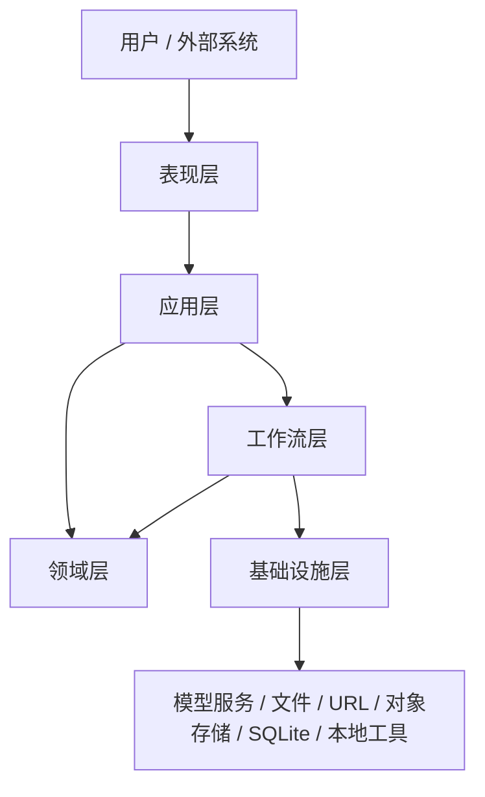
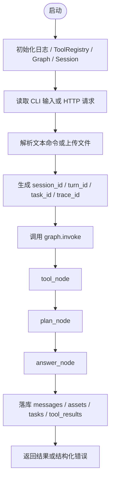

# 总体设计

## 1. 文档目的

说明 `simple-ai-agent` 项目的总体目标、架构边界、分层设计和核心运行机制。

## 2. 项目目标

本项目定位为一个分析型 Agent 底座，阶段 1 目标是形成最小企业级闭环：
- 支持 CLI 和 HTTP API
- 支持多模型接入
- 支持图片、音频、视频、文件的真实输入
- 支持本地工具网关
- 支持任务、资产、工具结果落库与查询
- 支持结构化排障

## 3. 总体架构

### 分层结构

- `presentation`
- `application`
- `domain`
- `workflow`
- `infrastructure`

### 总体架构图

## 4. 核心运行流程

## 5. 核心能力

- 多模型接入
- 多模态输入
- 上传文件标准化
- 工具自动路由
- PDF 解析
- 视频抽帧、抽音轨、关键帧 OCR、音轨 ASR
- 任务追踪
- 资产查询
- 结构化错误响应

## 6. 总体设计原则

- 职责分层清晰
- 输入统一标准化
- 工具调用可追踪
- 失败也必须可查询
- 文档与代码同步维护

## 7. 当前边界

当前不包含：
- 权限系统
- 分布式任务调度
- 多 Agent 编排
- 生产级监控平台

这些内容属于阶段 2 及以后。
