# 详细设计说明书

## 1. 设计范围

本说明书描述阶段 1 代码级设计和主要模块协作方式。

## 2. 主要模块

### 2.1 Presentation

#### 功能描述

Presentation 模块负责系统对外入口接入，承载 CLI 交互、HTTP API 请求接收、参数解析与结构化响应输出。

该模块是外部调用方进入系统的第一层边界，负责协议适配，不直接承载业务编排和底层资源操作。

#### 流程设计

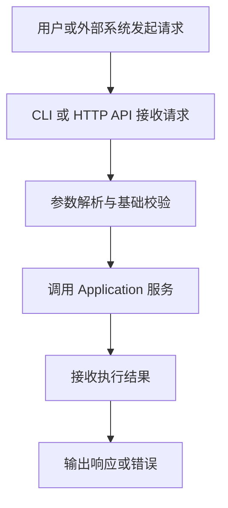

#### 界面设计

界面形式：
- CLI 命令行交互界面
- HTTP API 接口调用界面

当前不提供独立 Web 管理界面。

#### 处理逻辑

当前处理逻辑如下：
1. 接收 CLI 输入或 HTTP 请求
2. 对请求参数执行基础校验
3. 调用 Application 层完成输入标准化与任务编排
4. 接收工作流执行结果
5. 输出结构化响应或统一错误

主要文件：
- `app/presentation/cli.py`
- `app/presentation/api/app.py`
- `app/presentation/api/schemas.py`

### 2.2 Application

#### 功能描述

Application 模块负责系统应用层编排，承载会话初始化、输入解析、上传文件标准化、Prompt 构建以及 Session / Task 级别的执行上下文组织。

该模块用于连接表现层、工作流层和领域模型，是业务流程的主要组织层。

#### 流程设计

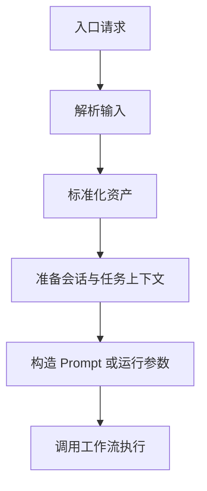

#### 界面设计

无独立界面。

#### 处理逻辑

当前处理逻辑如下：
1. 将用户输入解析为文本与资产对象
2. 完成上传文件标准化处理
3. 初始化或恢复会话状态
4. 生成 `turn_id / task_id / trace_id`
5. 构造 Prompt 与工作流执行上下文
6. 调用 Workflow 层并回收结果

主要文件：
- `app/application/agent_service.py`
- `app/application/upload_service.py`
- `app/application/prompt_builder.py`
- `app/application/services/session_service.py`
- `app/application/services/task_service.py`

### 2.3 Domain

#### 功能描述

Domain 模块负责定义系统中的核心领域模型，包括状态模型、资产模型、工具结果模型、持久化记录模型和错误模型。

该模块用于保证各层围绕同一套稳定数据结构协作，避免跨层出现隐式耦合。

#### 流程设计

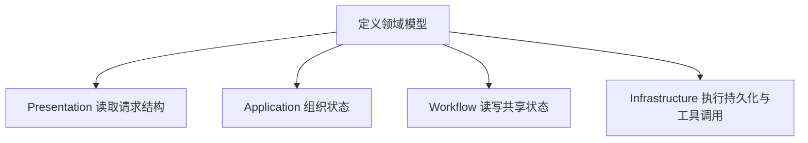

#### 界面设计

无独立界面。

#### 处理逻辑

当前处理逻辑如下：
1. 定义统一 `AgentState`
2. 定义消息、输入资产、工具结果等核心对象
3. 定义会话、任务、工具结果等持久化记录结构
4. 定义统一异常类型与错误分类
5. 为 Presentation、Application、Workflow、Infrastructure 提供共享约束

主要文件：
- `app/domain/models.py`
- `app/domain/errors.py`

### 2.4 Workflow

#### 功能描述

Workflow 模块负责组织 Agent 主执行链，当前采用单 Agent 线性工作流模式，包含 Tool、Plan、Answer 三个核心节点。

该模块用于在统一状态对象上完成工具调用、任务规划和最终回答生成。

#### 流程设计

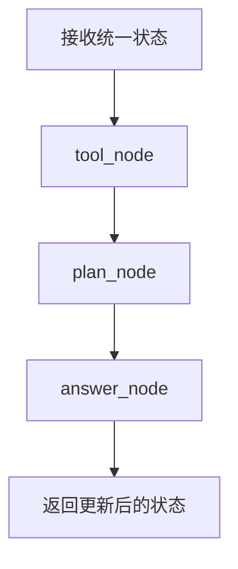

#### 界面设计

无独立界面。

#### 处理逻辑

当前处理逻辑如下：
1. `tool_node` 根据输入资产决定是否触发工具
2. 将工具结果写回共享状态
3. `plan_node` 基于输入与工具结果生成规划
4. `answer_node` 基于完整状态生成最终回答
5. 将更新后的消息、规划、回答和工具结果返回上层

主要文件：
- `app/workflow/graph.py`
- `app/workflow/nodes.py`

### 2.5 Infrastructure

#### 功能描述

Infrastructure 模块负责封装系统运行所依赖的基础设施能力，包括 LLM 调用、多媒体解析、上传存储、数据库、工具网关和日志组件。

该模块为上层提供稳定的技术能力入口，不直接承载业务规则。

#### 流程设计

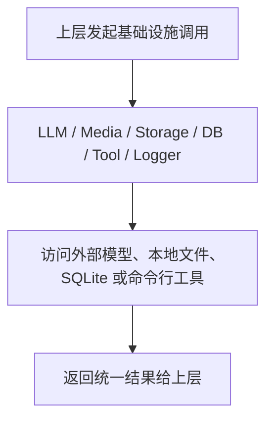

#### 界面设计

无独立界面。

#### 处理逻辑

当前处理逻辑如下：
1. 向上层暴露统一 LLM 调用接口
2. 提供图片、音频、视频、文件解析能力
3. 提供本地上传落盘能力
4. 提供 SQLite 持久化能力
5. 通过 Tool Registry 与 Local Runner 管理工具执行
6. 提供统一日志记录能力

## 3. 功能模块设计

### 3.1 统一状态模块

#### 功能描述

统一状态模块负责在整个工作流执行过程中维护共享状态，保证工具执行、规划生成、回答生成和持久化编排围绕同一份状态对象协作。

统一状态对象中包含用户输入、对话消息、输入资产、工具结果、执行标识、规划结果和最终回答等信息。

#### 流程设计

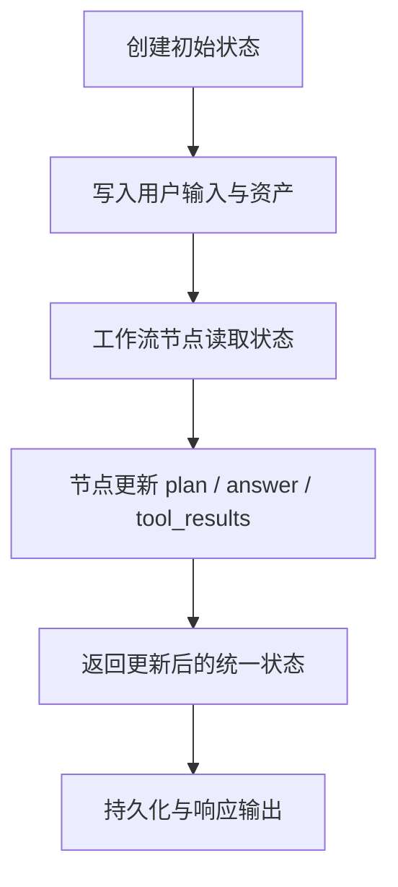

#### 界面设计

无独立界面。

#### 处理逻辑

当前处理逻辑如下：
1. 在会话初始化阶段创建默认状态对象
2. 在请求进入后写入当前轮输入、资产和执行标识
3. 在工作流节点间传递同一状态对象
4. 将规划、回答、工具结果持续写回状态
5. 在执行结束后将状态交给持久化模块和响应输出模块

### 3.2 主流程简洁性约束模块

#### 功能描述

主流程简洁性约束模块用于定义当前系统的核心执行主链边界，确保主流程只承载最小执行闭环，不被异步调度、权限控制和多 Agent 协同逻辑侵入。

当前主流程保持为固定线性链：`tool_node -> plan_node -> answer_node`。

#### 流程设计

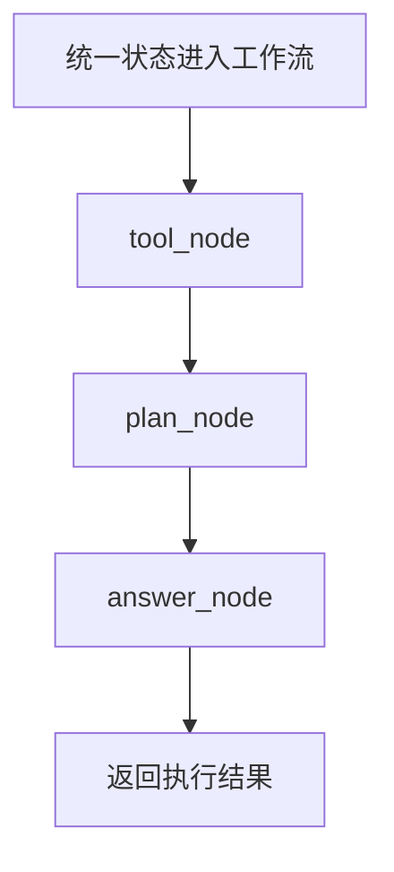

#### 界面设计

无独立界面。

#### 处理逻辑

当前处理逻辑如下：
1. 主流程只处理最小工具执行、任务规划和回答生成
2. 复杂治理能力优先在外围模块扩展
3. 不在当前主链中直接实现异步调度
4. 不在当前主链中直接散落权限判断
5. 多 Agent 能力后续通过新增路由和协调层扩展

### 3.3 请求路由模块

#### 功能描述

请求路由模块负责在保留主流程简洁性的前提下，为输入请求选择合适的工具处理路径或后续工作流执行路径。

当前实现中，请求路由能力以内聚形式存在于 `tool_node` 中，主要根据 `InputAsset.kind` 判断是否触发 OCR、ASR、视频探测、视频抽帧与抽音轨处理。

当前模块属于“最小路由实现”，尚未形成独立请求路由中台，但已经具备后续拆分的输入标准化、工具注册统一入口和链路追踪基础。

#### 流程设计

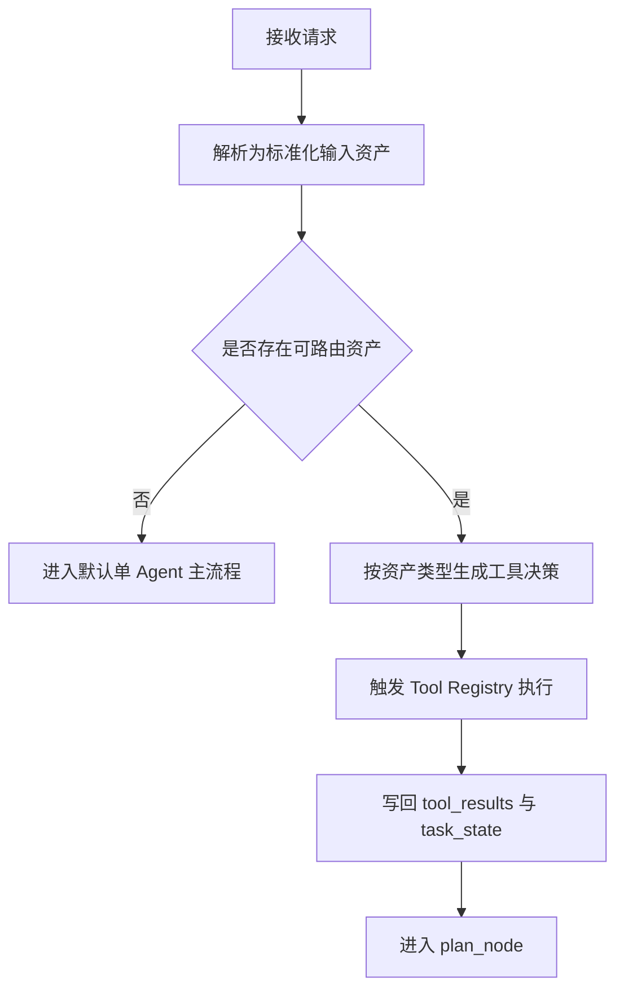

#### 界面设计

无独立界面。

#### 处理逻辑

当前处理逻辑如下：
1. 入口层将原始输入转换为统一 `InputAsset`
2. 工作流层读取资产类型
3. 根据 `image / audio / video` 等类型决定可触发工具
4. 使用 Tool Registry 统一执行工具
5. 将工具结果写回 `tool_results`
6. 将工具摘要写回 `task_state`
7. 后续节点基于路由结果继续规划与回答

后续建议将该模块从工作流节点中拆分为独立路由服务，输出 `RouteDecision`，再由不同执行图消费路由结果，以支持请求路由中台、多 Agent 路由和策略化分发。

### 3.4 分段持久化模块

#### 功能描述

分段持久化模块负责将一次执行中的不同类型数据分开保存，包括消息、输入资产、任务记录和工具结果记录。

该设计用于支撑失败排查、任务回查、工具结果追溯以及后续异步任务和多 Agent 执行片段扩展。

#### 流程设计

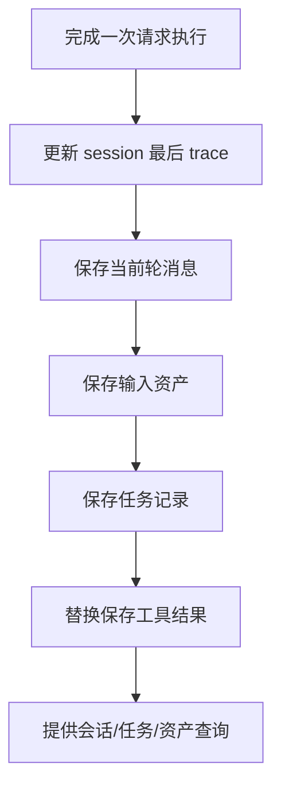

#### 界面设计

无独立界面。

#### 处理逻辑

当前按以下粒度持久化：
- `messages`
- `assets`
- `tasks`
- `tool_results`

当前处理逻辑如下：
1. 请求执行完成或失败后，统一进入持久化编排
2. 根据状态对象生成消息记录
3. 根据输入资产生成资产记录
4. 根据任务上下文生成任务记录
5. 根据工具执行结果生成工具结果记录
6. 通过查询接口提供会话、任务、资产和工具结果回查能力

该模块当前已经落地，是支撑“失败也必须可查询”的关键设计。后续如增加异步任务或多 Agent，需要在不破坏现有记录模型的前提下补充任务状态流转、路由决策记录和 Agent 执行片段记录。

### 3.5 统一异常处理模块

#### 功能描述

统一异常处理模块负责将参数错误、解析错误、模型错误、工具错误和系统错误收敛为统一结构响应，并在可行时补充失败任务持久化。

该模块主要位于 API 入口层，用于屏蔽内部异常差异，保证对外返回协议稳定。

#### 流程设计

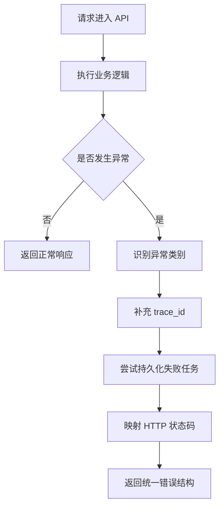

#### 界面设计

无独立界面。

#### 处理逻辑

当前处理逻辑如下：
1. API 层统一捕获 `AgentError`
2. 根据错误类别映射 HTTP 状态码
3. 若当前请求已生成状态对象，则补充 `trace_id`
4. 在失败场景下尝试持久化失败任务
5. 以统一错误结构输出 `category / code / message / trace_id / details`

该模块当前已经落地。后续如增加异步任务体系、权限控制或多 Agent 编排，需要继续复用统一错误模型，并增加任务级、授权级和子任务级异常分类。

### 3.6 异步任务体系预留模块

#### 功能描述

异步任务体系预留模块用于支撑长耗时任务脱离同步请求链路执行，后续可扩展为任务提交、排队、执行、重试、取消和结果回查能力。

当前项目已具备 `task_id`、任务表和任务查询接口，但尚未实现真正的异步执行基础设施。

#### 流程设计

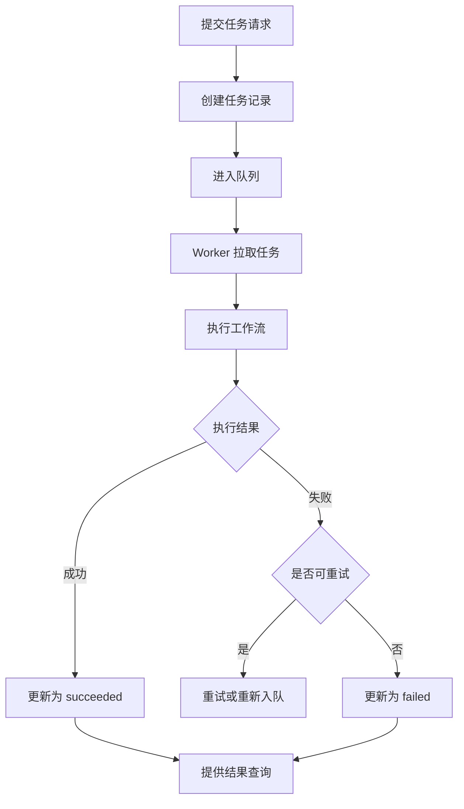

#### 界面设计

无独立界面。

#### 处理逻辑

当前状态：
- 已存在统一任务标识和任务查询基础
- 当前执行仍为同步执行
- 当前无消息队列、无 Worker、无任务调度器、无回调通知

后续处理逻辑建议如下：
1. 入口层提交异步任务并立即返回 `task_id`
2. 应用层写入初始任务状态
3. 基础设施层将任务送入队列
4. Worker 拉取后调用既有工作流执行
5. 执行过程中统一写入任务状态和链路记录
6. 失败任务按策略重试或终止
7. 调用方通过任务接口查询最终结果

### 3.7 权限控制预留模块

#### 功能描述

权限控制预留模块用于在后续版本中增加统一身份认证、资源级授权、工具级授权与审计记录能力。

该模块的目标是将安全控制从业务编排中解耦，避免权限判断散落在各个工作流节点中。

#### 流程设计

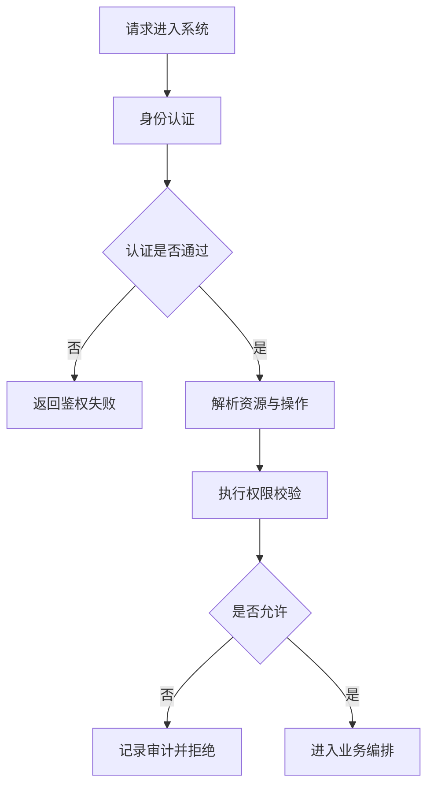

#### 界面设计

无独立界面。

#### 处理逻辑

当前状态：
- 当前版本无统一鉴权
- 当前版本无 RBAC 或 ABAC
- 当前版本无工具级授权与审计拦截

后续处理逻辑建议如下：
1. 表现层负责身份认证
2. 应用层负责会话、任务、工具等操作的权限校验
3. 基础设施层负责 Token、密钥、审计日志和策略存储
4. 对敏感工具调用增加授权检查与审计记录
5. 对权限拒绝输出统一错误结构

### 3.8 多 Agent 编排预留模块

#### 功能描述

多 Agent 编排预留模块用于将当前单 Agent 执行图扩展为多角色协同执行模式，支持任务拆分、执行接力、结果汇聚和统一追踪。

当前项目仅支持单 Agent 线性执行图，多 Agent 编排仍处于预留设计阶段。

#### 流程设计

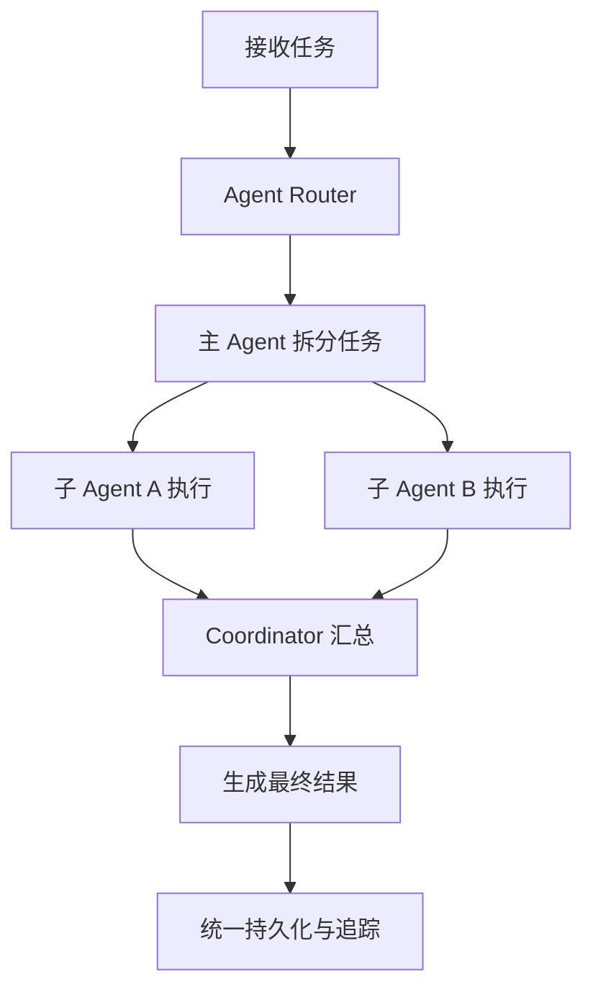

#### 界面设计

无独立界面。

#### 处理逻辑

当前状态：
- 当前仅存在单 Agent 线性执行图
- 当前无 Agent Router
- 当前无 Agent Handoff
- 当前无协同状态管理

后续处理逻辑建议如下：
1. 保留当前单 Agent 执行图作为默认图
2. 增加 Agent Router 判断是否进入多 Agent 模式
3. 由协调者分配子任务给不同 Agent
4. 子 Agent 复用现有工具入口、任务模型和追踪模型执行
5. 汇总模块合并子任务结果并生成最终回答
6. 统一写回任务、工具结果和链路追踪信息

## 4. 现有功能链路补充设计

### 4.1 上传链路模块

#### 功能描述

上传链路模块负责接收上传文件请求，将文件保存到本地下载目录，生成标准化输入资产，并根据配置选择是否立即触发工具处理。

该模块用于打通上传型多模态输入到后续工作流和持久化链路。

#### 流程设计

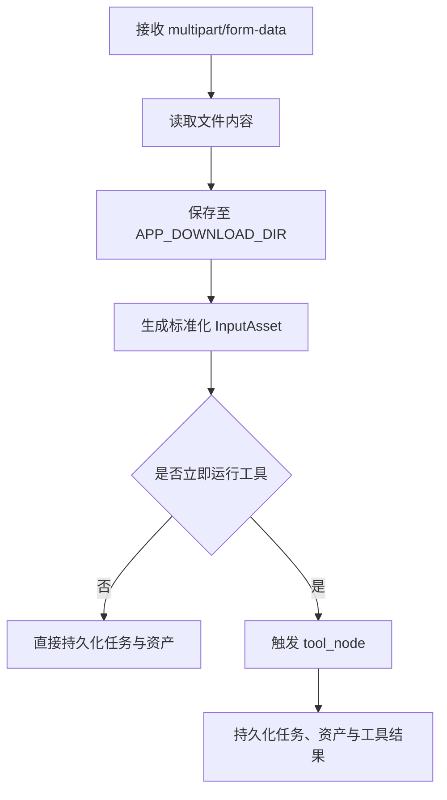

#### 界面设计

界面形式：
- HTTP 文件上传接口

无独立前端页面。

#### 处理逻辑

上传流程：
1. 接收 `multipart/form-data`
2. 文件写入 `APP_DOWNLOAD_DIR`
3. 生成标准化 `InputAsset`
4. 可选触发 `tool_node`
5. 资产与任务落库

### 4.2 视频后处理链模块

#### 功能描述

视频后处理链模块负责对视频输入执行探测、抽帧、关键帧 OCR、抽音轨和音轨 ASR 等后处理操作。

该模块用于将视频输入转换为可被规划与回答阶段理解的结构化工具结果和衍生资产。

#### 流程设计

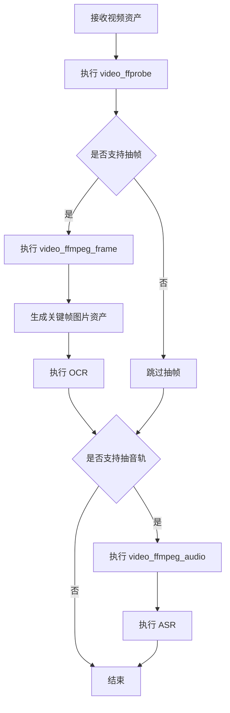

#### 界面设计

无独立界面。

#### 处理逻辑

当前视频链包括：
1. `video_ffprobe`
2. `video_ffmpeg_frame`
3. 关键帧回灌为图片资产
4. 关键帧 OCR
5. `video_ffmpeg_audio`
6. 音轨 ASR

### 4.3 PDF 解析链模块

#### 功能描述

PDF 解析链模块负责对文件型输入中的 PDF 内容执行文本抽取，并将解析结果转为后续可用的文本信息。

该模块用于补齐文档类输入的基础解析能力。

#### 流程设计

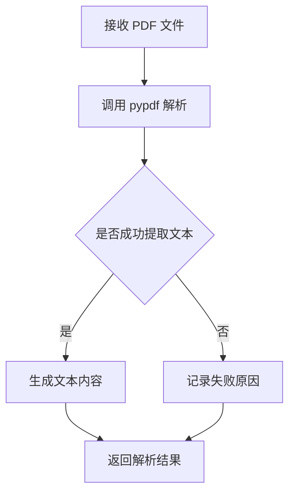

#### 界面设计

无独立界面。

#### 处理逻辑

PDF 解析使用：
- `pypdf`

处理逻辑：
- 尝试提取页面文本
- 提取失败时明确标记失败原因

## 5. 错误处理设计

### 5.1 错误处理模块

#### 功能描述

错误处理模块负责对系统执行过程中产生的参数错误、解析错误、模型错误、工具错误和持久化错误进行统一分类、统一封装和统一输出。

该模块的目标是保证系统在失败场景下仍具备可定位、可查询和可追踪能力。

#### 流程设计

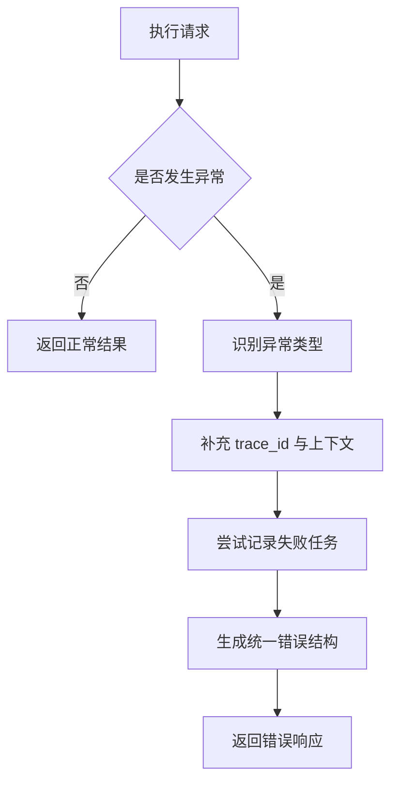

#### 界面设计

无独立界面。

#### 处理逻辑

当前错误类型包括：
- 参数错误
- 解析错误
- 模型错误
- 工具错误
- 持久化错误

当前处理逻辑如下：
1. 在 API 层统一接收异常
2. 根据异常分类决定返回状态码和错误类别
3. 尽可能补充 `trace_id` 和上下文信息
4. 在失败场景下尝试持久化失败任务
5. 输出统一错误响应结构

所有错误通过 API 统一结构输出。

## 6. 当前实现结论

当前版本已经支持：
- 单 Agent 主流程
- 基于资产类型的最小请求路由
- 分段持久化
- 统一异常处理

当前版本尚未支持：
- 独立请求路由中台
- 异步任务体系
- 统一权限控制
- 多 Agent 编排
