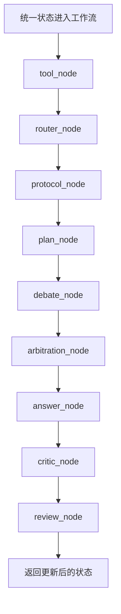
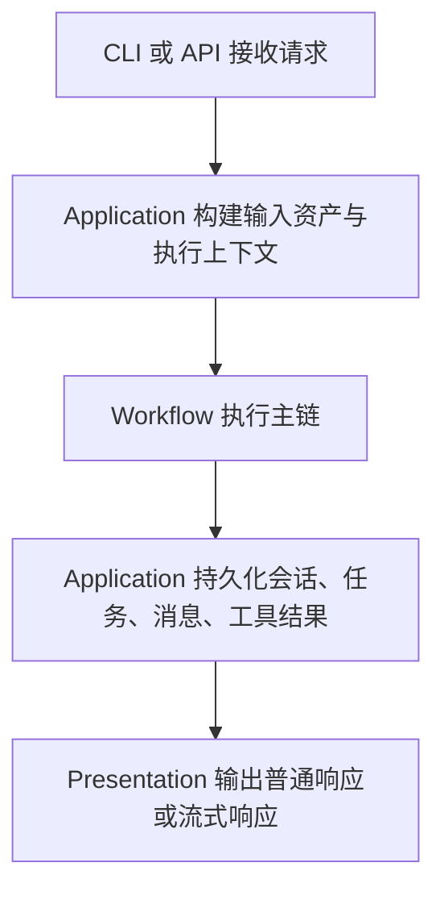
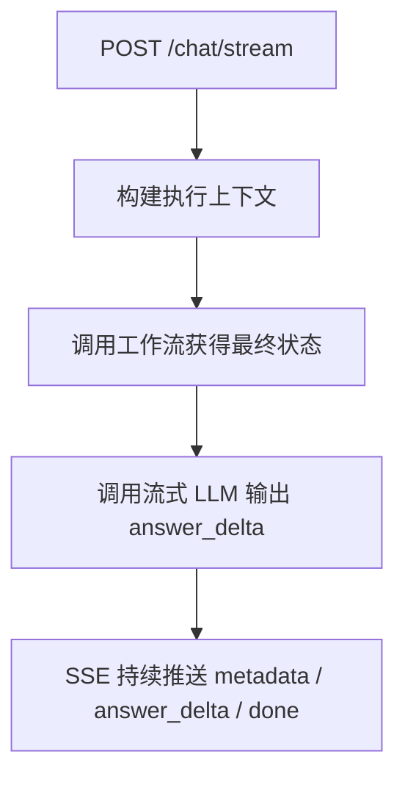
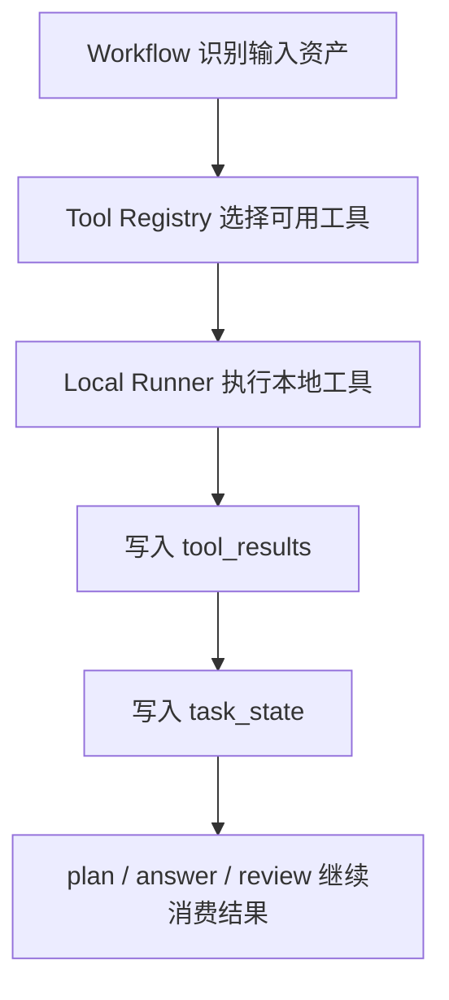
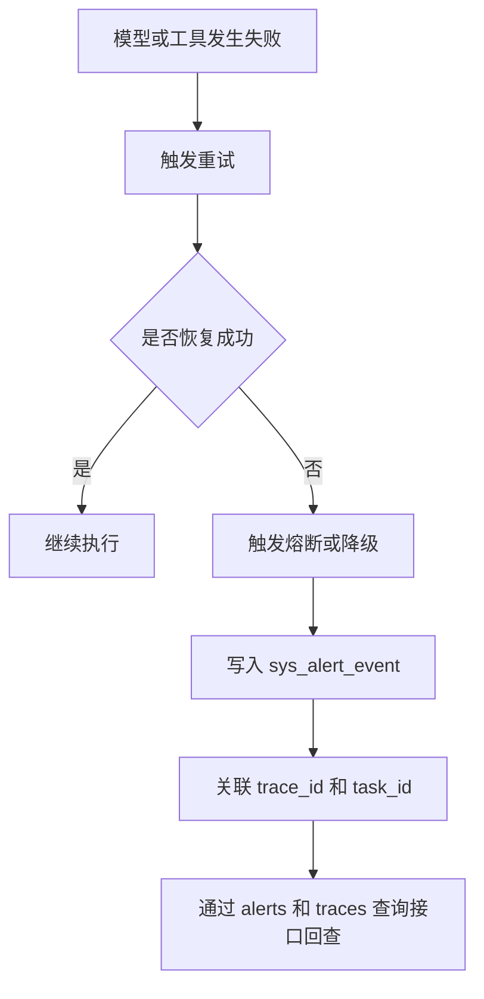

# 详细设计说明书

## 1. 文档目的

本文档用于说明 AgentOps 当前版本的代码级设计、模块职责、层间协作方式和目录结构约束。

本文档面向以下读者：
- 后端开发人员
- 测试人员
- 架构评审人员
- 后续阶段接手维护的工程人员

本文档描述的是当前仓库已经落地的真实结构，不提前展开为未来平台化终局结构。

## 2. 设计范围

当前详细设计覆盖以下内容：
- 五层结构设计
- 目录层级说明
- 核心模块职责
- 工作流执行链路
- 数据持久化与查询链路
- 鉴权、治理、恢复、追踪设计
- 流式对话设计
- 阶段边界与后续扩展点

当前版本不在本文档中展开以下内容：
- 可视化控制台前端实现
- 完整异步任务平台实现
- 多租户管理后台实现
- 阶段 3 的观测面板实现

## 3. 总体设计原则

### 3.1 五层分离原则

系统保留五层结构：
- `presentation`
- `application`
- `domain`
- `workflow`
- `infrastructure`

这样设计的目的如下：
- 让对外接入、业务编排、领域模型、执行图和基础设施职责分离
- 让接口协议变化不直接影响领域模型
- 让基础设施替换不直接影响工作流逻辑
- 让后续阶段扩展多 Agent、异步任务、控制台和 SDK 时有稳定边界

### 3.2 最小闭环优先原则

当前阶段优先保证以下闭环：
- 可对话
- 可调用工具
- 可持久化
- 可追踪
- 可治理
- 可恢复

不在当前阶段为了目录完整性提前拆出大量空壳模块。

### 3.3 配置化优先原则

运行时能力尽量通过配置中心和环境变量驱动，而不是将策略硬编码在节点内部。

当前已落地的配置化能力包括：
- 运行时配置中心
- 角色注册配置
- 恢复策略配置
- 安全限制配置

## 4. 当前目录结构设计

### 4.1 仓库级目录结构

以下目录树为当前仓库的主要逻辑结构。每个层级后均附带说明。

```text
agentops/                                  # 仓库根目录，统一承载服务端代码、测试、文档和部署辅助文件
├── app/                                   # 主应用目录，承载当前服务端所有运行时代码
│   ├── presentation/                      # 表现层，对外暴露 CLI 和 HTTP API，不承载核心业务规则
│   │   ├── cli.py                         # 命令行入口，负责持续对话、流式输出和用户交互
│   │   └── api/                           # HTTP API 入口，负责路由、协议适配、响应封装
│   │       ├── app.py                     # FastAPI 应用工厂，注册路由、中间件和错误处理
│   │       ├── schemas.py                 # API 请求与响应模型，统一对外数据结构
│   │       └── middleware/                # API 中间件层，统一治理请求横切逻辑
│   │           ├── auth.py                # 鉴权中间件，处理 API Key / Bearer 校验
│   │           ├── governance.py          # 限流、幂等和通用治理中间件
│   │           └── trace.py               # 请求追踪中间件，生成 request_id / trace_id
│   │
│   ├── application/                       # 应用服务层，负责组织用例、拼装上下文、调用工作流和持久化服务
│   │   ├── agent_service.py               # 统一组织聊天请求、资产输入和工作流调用
│   │   ├── prompt_builder.py              # Prompt 构造器，负责各角色和各节点的提示词拼装
│   │   ├── upload_service.py              # 上传编排服务，负责上传、落盘、资产标准化和工具试跑
│   │   ├── image_service.py               # 图片输入标准化服务
│   │   ├── audio_service.py               # 音频输入标准化服务
│   │   ├── video_service.py               # 视频输入标准化服务
│   │   ├── file_service.py                # 文件输入标准化服务
│   │   └── services/                      # 面向领域动作的应用服务集合
│   │       ├── session_service.py         # 会话、消息、任务、资产、工具结果持久化编排
│   │       ├── task_service.py            # 任务查询与任务级操作服务
│   │       ├── chat_service.py            # 对话服务，负责标准/流式回答输出编排
│   │       ├── config_service.py          # 运行时配置中心读写服务
│   │       ├── workflow_role_service.py   # 角色注册与角色配置服务
│   │       └── alert_service.py           # 告警记录与告警查询服务
│   │
│   ├── domain/                            # 领域层，定义稳定的数据模型、错误模型和仓储接口
│   │   ├── models.py                      # 核心领域模型，包括状态、任务、追踪、角色、工具结果等
│   │   ├── errors.py                      # 统一错误模型，定义分类、错误码和领域异常
│   │   └── repositories/                  # 仓储接口定义层，约束持久化读写边界
│   │       ├── user_repository.py         # 用户仓储接口
│   │       ├── session_repository.py      # 会话仓储接口
│   │       ├── message_repository.py      # 消息仓储接口
│   │       └── asset_repository.py        # 资产仓储接口
│   │
│   ├── workflow/                          # 工作流层，负责 LangGraph 图、节点执行、路由策略和角色注册
│   │   ├── graph.py                       # 工作流图定义，组织节点执行顺序
│   │   ├── nodes.py                       # 工作流节点实现，包括 tool、router、protocol、plan、debate 等
│   │   ├── policies.py                    # 路由与工作流策略函数
│   │   └── registry.py                    # 工作流注册中心，提供角色和协议配置读取入口
│   │
│   └── infrastructure/                    # 基础设施层，封装数据库、模型、工具、追踪、日志和存储能力
│       ├── llm/                           # 大模型接入层，负责统一兼容 OpenAI 协议与 mock 模式
│       │   └── client.py                  # 模型调用、流式输出、重试、熔断和降级入口
│       ├── media/                         # 多媒体解析层，负责图片、音频、视频、文件真实读取与标准化
│       │   ├── image_loader.py            # 图片加载与元数据处理
│       │   ├── audio_loader.py            # 音频加载与元数据处理
│       │   ├── video_loader.py            # 视频加载与元数据处理
│       │   └── file_loader.py             # 文件加载，包含 PDF 等文件正文解析
│       ├── tools/                         # 工具执行层，负责工具注册、命令执行、重试、熔断与恢复
│       │   ├── registry.py                # 工具注册中心
│       │   ├── adapters.py                # 本地工具适配器定义，如 OCR、ASR、FFmpeg
│       │   ├── local_runner.py            # 本地工具统一执行入口
│       │   ├── retry_policy.py            # 工具和模型通用重试策略
│       │   └── failure_recovery.py        # 熔断、恢复和降级控制
│       ├── persistence/                   # 持久化实现层，负责 SQLite 表结构和仓储实现
│       │   ├── database.py                # 建表、迁移兼容、索引和版本初始化
│       │   └── repositories.py            # 仓储接口的 SQLite 实现
│       ├── storage/                       # 上传与本地存储层
│       │   └── local_upload_store.py      # 本地上传目录管理和文件落盘实现
│       ├── trace/                         # 追踪实现层，负责 request trace 落库和查询
│       │   └── service.py                 # trace 服务实现
│       ├── alert/                         # 告警实现层，负责告警落库和检索
│       │   └── service.py                 # alert 服务实现
│       ├── auth/                          # 认证实现层，负责 token 与 key 认证能力
│       │   └── service.py                 # 认证与最小 RBAC 授权服务实现
│       └── logger.py                      # 日志初始化与统一日志输出入口
│
├── tests/                                 # 测试目录，按测试层级拆分
│   ├── unit/                              # 单元测试，验证模块内部逻辑
│   ├── integration/                       # 集成测试，验证接口、数据库、工具和工作流协作
│   └── e2e/                               # 端到端测试，验证主链路闭环
│
├── docs/                                  # 文档主目录
│   ├── enterprise/                        # 企业级正式文档主版本目录
│   ├── architecture/                      # 架构资料与规划文档目录
│   ├── api/                               # 接口说明与 API 补充文档目录
│   └── prompts/                           # Prompt 设计说明目录
│
├── data/                                  # 本地测试数据、样例文件和工具输出目录
├── logs/                                  # 日志输出目录
├── run.py                                 # CLI 启动入口脚本
├── README.md                              # 项目说明、快速启动和文档索引
└── AGENTS.md                              # 仓库级规则文件
```

### 4.2 当前结构为何采用五层而不是更重的终局结构

当前结构刻意没有扩展为“平台终局目录”，原因如下：
- 当前阶段仍以服务端底座能力建设为主
- 代码体量尚不适合拆成大量空壳子目录
- 当前优先目标是治理能力、可排障能力和多 Agent 最小编排
- 当前尚未进入 SDK、多端前端、控制台、租户管理和异步平台的全面建设期

因此，当前详细设计坚持“先把能力做深，再把目录做大”的原则。

## 5. 分层设计说明

### 5.1 Presentation 层

#### 这是什么

Presentation 层是系统对外的接入边界。

#### 做什么

主要职责如下：
- 接收 CLI 输入
- 接收 HTTP 请求
- 进行协议级参数校验
- 调用 Application 层服务
- 统一输出结构化响应
- 统一输出流式响应
- 统一处理中间件和错误映射
- 统一执行认证与授权边界

#### 为什么这样做

这样设计的原因如下：
- 将 CLI 和 HTTP 协议适配限制在最外层
- 避免业务逻辑渗入 API 路由
- 便于后续新增 SSE、WebSocket 或外部 SDK 接入

#### 当前子层说明

- `app/presentation/cli.py`
  - 负责命令行持续对话
  - 负责流式打印最终回答
  - 负责退出控制和最小输入校验

- `app/presentation/api/app.py`
  - 负责 FastAPI 路由注册
  - 负责将应用服务暴露为 HTTP API
  - 负责 SSE 流式对话接口

- `app/presentation/api/schemas.py`
  - 负责请求模型与响应模型定义
  - 保证对外接口结构稳定

- `app/presentation/api/middleware/`
- `auth.py`：请求鉴权
  - `governance.py`：限流、幂等、治理
  - `trace.py`：请求追踪

### 5.2 Application 层

#### 这是什么

Application 层是系统用例编排层。

#### 做什么

主要职责如下：
- 解析用户输入
- 组装输入资产
- 创建执行上下文
- 构建 Prompt
- 调用工作流
- 调用持久化服务
- 调用配置和角色服务
- 组织最终响应对象

#### 为什么这样做

这样设计的原因如下：
- 避免将编排逻辑塞入 API 层
- 避免将用例级逻辑塞入领域模型
- 让工作流层专注执行图，不承担上下文拼装和存储编排

#### 当前子层说明

- `agent_service.py`
  - 系统主入口编排服务
  - 负责把文本、资产、上下文和工作流连接起来

- `prompt_builder.py`
  - 负责生成 planner、executor、critic、reviewer、arbitration 等角色 Prompt
  - 负责不同执行协议的提示词拼装

- `upload_service.py`
  - 负责上传文件的保存、标准化和分析前编排

- `image_service.py` / `audio_service.py` / `video_service.py` / `file_service.py`
  - 负责不同媒介输入的标准化

- `services/`
  - `session_service.py`：会话、消息、任务、资产、工具结果的统一落库编排
  - `task_service.py`：任务查询和任务维度服务
  - `chat_service.py`：标准回答与流式回答的服务编排
  - `config_service.py`：配置中心读写服务
  - `workflow_role_service.py`：角色注册服务
  - `alert_service.py`：告警查询与告警记录服务

### 5.3 Domain 层

#### 这是什么

Domain 层是当前系统中最稳定的数据模型层和规则边界层。

#### 做什么

主要职责如下：
- 定义统一状态模型
- 定义任务、会话、消息、资产、追踪、工具结果等模型
- 定义统一错误分类
- 定义仓储接口契约

#### 为什么这样做

这样设计的原因如下：
- 让五层围绕同一组模型协作
- 避免每层维护一套自己的数据结构
- 为未来拆分 core 层或多服务演进保留边界

#### 当前子层说明

- `models.py`
  - 承载 `AgentState`、`TaskRecord`、`ToolResultRecord`、`RequestTraceRecord`、`WorkflowRoleRecord` 等模型

- `errors.py`
  - 定义参数错误、解析错误、模型错误、工具错误、持久化错误、鉴权错误等统一异常

- `repositories/`
  - 定义 user、session、message、asset 等仓储接口
  - 当前接口不追求过细，优先满足系统实际能力

### 5.4 Workflow 层

#### 这是什么

Workflow 层是 Agent 执行图层。

#### 做什么

主要职责如下：
- 定义 LangGraph 节点顺序
- 路由执行模式
- 选择执行协议
- 调用工具节点
- 生成计划
- 生成辩论观点
- 执行仲裁
- 生成最终回答
- 执行批评和复核

#### 为什么这样做

这样设计的原因如下：
- 把“如何执行任务”与“如何接收请求”分离
- 把多 Agent 编排控制在统一图中
- 便于后续扩展新节点和新协议

#### 当前工作流主链

当前主链路如下：



#### 当前子层说明

- `graph.py`
  - 定义节点顺序和图编排

- `nodes.py`
  - 承载各个执行节点
  - 是当前多 Agent 最小编排的核心实现位置

- `policies.py`
  - 负责路由和工作流决策规则

- `registry.py`
  - 提供工作流运行时配置读取和角色配置读取能力

### 5.5 Infrastructure 层

#### 这是什么

Infrastructure 层是系统所有外部依赖和技术实现的封装层。

#### 做什么

主要职责如下：
- 模型调用
- 媒体解析
- 工具执行
- 数据库存储
- 文件上传落盘
- 请求追踪
- 告警记录
- 认证实现
- 日志输出

#### 为什么这样做

这样设计的原因如下：
- 把外部依赖集中隔离
- 让模型和工具实现可替换
- 让上层不直接依赖 SQLite、命令行工具和具体 SDK

#### 当前子层说明

- `llm/`
  - 统一封装模型调用和流式输出
  - 实现重试、熔断和降级

- `media/`
  - 统一封装图片、音频、视频、文件读取和解析
  - PDF 正式解析链已接入

- `tools/`
  - 统一封装 OCR、ASR、FFmpeg 等本地工具
  - 提供注册、执行、重试、熔断、恢复和降级机制

- `persistence/`
  - 统一管理数据库表结构、索引、结构版本和仓储实现
  - 遵循系统表 `sys_`、业务表 `biz_` 的数据库规范

- `storage/`
  - 统一管理上传目录和本地文件保存
  - 默认下载/上传目录受 `APP_DOWNLOAD_DIR` 控制

- `trace/`
  - 统一记录请求 trace 并提供查询能力

- `alert/`
  - 统一记录恢复告警、熔断告警和失败告警

- `auth/`
  - 统一处理 API Key、Bearer 鉴权和最小 RBAC 授权实现

- `logger.py`
  - 统一日志初始化与日志级别控制

## 6. 关键执行链设计

### 6.1 对话链路



处理逻辑如下：
1. Presentation 接收请求
2. Application 解析文本和资产输入
3. Application 生成 `session_id / turn_id / task_id / trace_id`
4. Workflow 执行主链
5. Session Service 将结果分段落库
6. Presentation 返回标准响应或 SSE 流式响应

### 6.2 流式对话链路



说明如下：
- 当前流式输出面向最终回答阶段
- metadata 先返回任务与会话标识
- answer_delta 逐段返回文本
- done 表示流式结束
- error 表示流式过程中发生错误

### 6.3 工具调用链路



说明如下：
- 工具注册由 registry 统一管理
- 本地工具通过 adapters 统一封装
- 执行结果写回状态和数据库
- 失败会触发告警与恢复策略

### 6.4 恢复与告警链路



## 7. 数据持久化设计

### 7.1 持久化目标

当前持久化设计目标如下：
- 请求可追踪
- 会话可回放
- 任务可查询
- 资产可回查
- 工具结果可审计
- 恢复告警可追踪
- 运行时配置可管理
- 角色协议可配置

### 7.2 当前核心表

系统表：
- `sys_schema_version`
- `sys_user`
- `sys_request_trace`
- `sys_runtime_config`
- `sys_workflow_role`
- `sys_alert_event`

业务表：
- `biz_session`
- `biz_message`
- `biz_asset`
- `biz_task`
- `biz_tool_result`

### 7.3 当前持久化原则

- 所有表必须有主键
- 不使用外键约束
- 使用 `sys_` 和 `biz_` 区分系统表与业务表
- 所有表统一带审计字段和扩展字段
- 结构版本统一由 `sys_schema_version` 维护

## 8. 安全与治理设计

### 8.1 统一鉴权

当前支持：
- `X-API-Key`
- `Authorization: Bearer ...`
- 最小 RBAC 权限校验

设计目的：
- 在 API 层建立统一认证边界
- 避免业务逻辑自行处理身份校验

### 8.2 限流与幂等

当前支持：
- 请求限流
- 幂等键控制

设计目的：
- 防止高频请求压垮底座
- 防止重放写请求导致重复执行

### 8.3 运行时配置中心

当前支持：
- 数据库优先
- 环境变量兜底

作用如下：
- 管理运行时策略
- 管理恢复策略
- 管理角色和执行协议
- 管理安全边界配置

## 9. 当前阶段与后续扩展点

### 9.1 当前阶段已完成

当前已完成以下能力：
- 阶段 1 全部能力
- 阶段 2 前半段治理底座
- 阶段 2 最小多 Agent 编排
- 正式角色协议
- 可切换执行协议
- 流式对话输出

### 9.2 当前未完成但已预留

当前已预留但未完整实现的能力如下：
- 完整 RBAC 权限体系
- 完整异步任务平台
- 可视化 trace 和观测面板
- 更细粒度策略中心
- 更复杂多 Agent 协议

### 9.3 后续扩展建议

后续扩展建议按以下顺序推进：
1. RBAC 最小版
2. 异步任务平台预留
3. 可视化 trace 前置接口
4. 观测面板与控制台
5. 更完整多 Agent 协同协议

## 10. 结论

当前系统已经从“单轮问答示例工程”演进为“具备治理能力、追踪能力、恢复能力和最小多 Agent 编排能力的 Agent 底座”。

当前详细设计的关键结论如下：
- 五层结构清晰且与当前代码一致
- 目录层级已经能够支撑阶段 2 继续演进
- 工作流主链已具备可扩展性
- 配置、恢复、角色和追踪已形成治理闭环
- 当前结构适合继续渐进式演进，而不适合立即重构为终局平台目录
